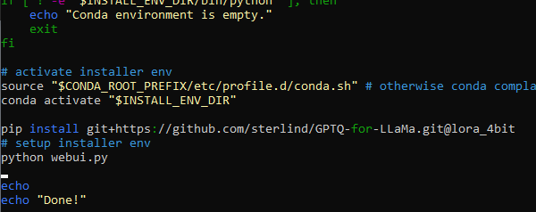
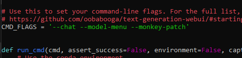

# Простая инструкция по обучению LoRA при помощи text-generation-webui

1. Установите WSL/Ubuntu
2. Выполните следующие команды
```
apt update && upgrade
```
```
apt install python python3-pip wget unzip git
```
```
wget https://github.com/oobabooga/text-generation-webui/releases/download/installers/oobabooga_linux.zip
```
```
unzip oobabooga_linux.zip -d oobabooga_linux
```
```
cd oobabooga_linux
```
```
chmod +x start_linux.sh
```
*Если вы планируете работать с 4bit моделью, то на данном этапе необходимо спуститься в конец инструкции и выполнить содержимое блока ```Дополнение для работы с 4bit моделями```*
```
./start_linux.sh
```
3. При установке выберите ```A) NVIDIA``` *(либо другое, в зависимости от вашей видеокарты)*


4. Дождитесь завершения установки
5. Поместите в папку ```text-generation-webui/models``` свою модель
6. Поместите в папку ```text-generation-webui/training/datasets``` свой датасет
7. Выполните команду
```
./start_linux.sh
```
8. В браузере откройте ```http://127.0.0.1:7860/```
9. Перейдите на вкладку ```Training```


* Рекомендуемые настройки для RTX 2060s+3070 (8+8GB VRAM):
```
"Save every n steps" = 1024
"Micro Batch Size" = 1
"Batch Size" = 64
"Epochs" = 5
"Cutoff Length" = 128
Остальные настройки оставить дефолтными
```


10. В меню ```Formatted dataset```:
* Выберите ранее добавленный датасет в ```Dataset```
* Выберите ```alpaca-format``` *(либо любой другой, который вы используете)* в ```Data Format```
* ```Evaluation Dataset``` обязательно оставить ```None```


11. Нажмите ```Start LoRA Training```


12. По окончании процесса LoRA будет находиться в папке text-generation-webui/loras

# Дополнение для работы с 4bit моделями:

Выполните следующие пункты и вернитесь обратно в основную инструкцию:
```
cd text-generation-webui/repositories
```
```
git clone https://github.com/johnsmith0031/alpaca_lora_4bit
```
```
nano start_linux.sh
```
* После строки ```conda activate @$INSTALL_ENV_DIR``` допишите
```
pip install git+https://github.com/sterlind/GPTQ-for-LLaMa.git@lora_4bit
```



*После первого запуска (8) можно будет повторно отредактировать файл и убрать эту строку*
* ctrl + s и ctrl + x
```
nano webui.py
```
* В переменной ```CMD_FLAGS``` к уже имеющимся аргументам дописать ```--monkey-patch```



* ctrl + s и ctrl + x
